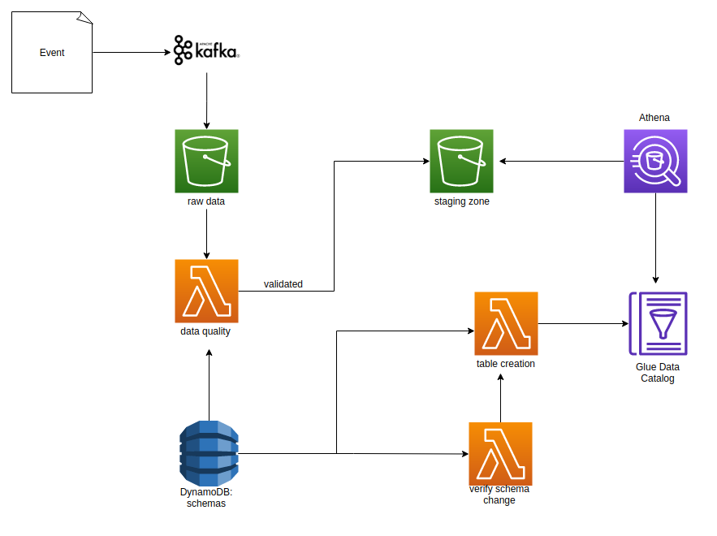

# data-challenge

Para o desenho da arquitetura, eu optei por utlizar o Kafka para receber os eventos e salvá-los em um tópico raw. 
Depois, esses eventos serão salvos em um bucket de dados raw. Quando novos dados baterem nesse bucket, uma
lambda será ativada, a qual fará a verificação do schema do evento. Caso o evento passe nas validações de
data quality, ele será enviado para outro bucket, staging zone. Será aqui que os usuários irão consumir os dados,
a partir do Athena.

As tabelas são criadas por uma Lambda e o catálogo de dados é administrado pelo Glue Data Catalog. Os esquemas
ficam salvos no DynamoDB, e quando houver modificação nos esquemas, é triggada uma outra lambda,
a fim de criar uma nova tabela. 

