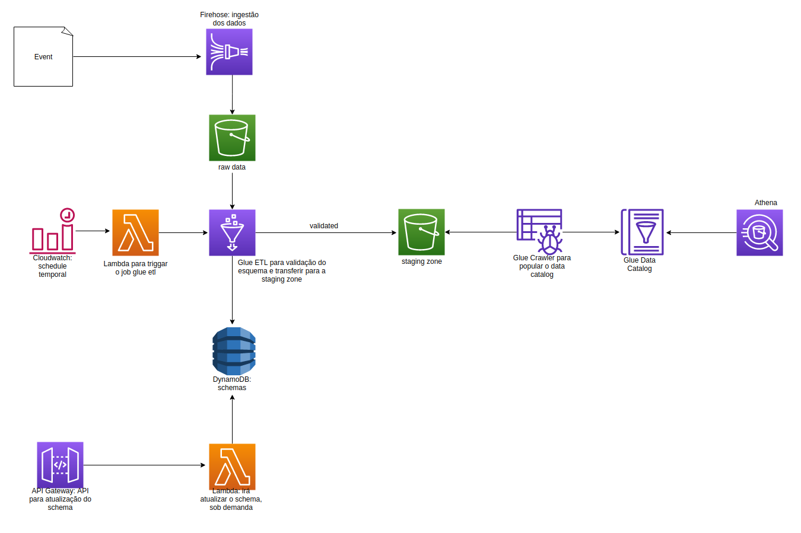

# data-challenge

Para o desenho da arquitetura, resolvi utilizar o Kinesis Firehose para a ingestão dos dados. Os dados ingeridos pelo 
Firehose serão salvos em um bucket de dados raw no s3. 

Um scheduler do Cloudwatch irá acionar uma Lambda Function que, por sua vez, acionará um job do Glue ETL. 
Esse job (PySpark) fara a validação do Schema dos dados raw além de fazer a transferência para um outro bucket,
staging zone. O job do Glue irá acessar o DynamoDB para obtenção dos Schemas. Além disso, proponho uma forma
simplificada para alterração dos Schemas, utilizando uma api em conjunto com o API Gateway da AWS e uma outra
função Lambda. 

Para a criação das tabelas do Athena, proponho não utilizar uma Lambda para isso, mas sim
o Glue Crawler, que irá popular o Glue Data Catalog. Com isso, será possível fazer queries SQL no bucket da
staging zone, a partir do Athena. 

Uma outra possibilidade interessante seria utilizar o Kafka para a ingestão e verificação do Schema. 
Utilizando streams no kSQL junto com o Schema Registry do Kafka, seria possível verificar se os eventos que 
chegam estão de acordo com o Schema previsto. Com isso, não haveria a necessidade do bucket raw, do job do Glue ETL,
das duas funções Lambdas, do Cloudwatch, do DynamoDB e da API. O Kafka (com um Kafka Connect Sink) salvaria
os dados validados diretamente no bucket da staging zone.

